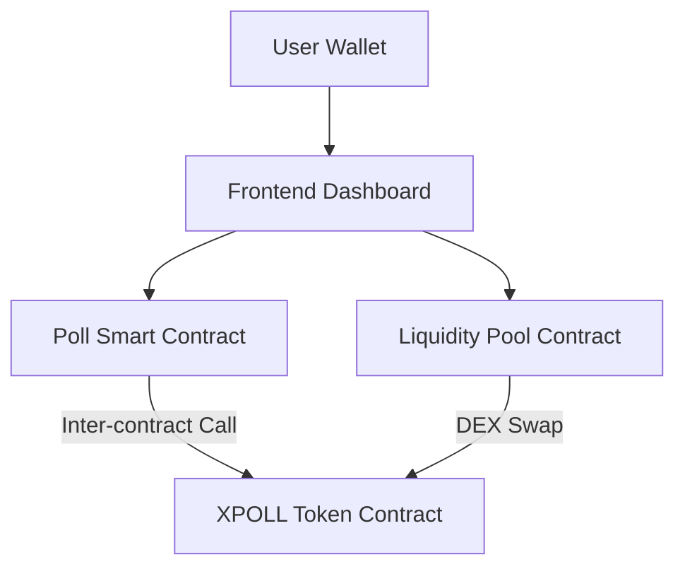

# 🌊 Enhanced Live Poll - Level 4 Green Belt Implementation

<<<<<<< HEAD
## 📌 Quick Navigation
* [🏆 Level 2: Yellow Belt Submission](#-yellow-belt-submission-links)
* [🏆 Level 3: Green Belt Submission](#-green-belt-level-3-submission-details-official)
* [🏆 Level 4: Advanced Green Belt (DEX & Tokens)](#-level-4-advanced-green-belt-implementation-official)
=======
## 📍 Quick Navigation
* [🟡 Level 2: Yellow Belt Submission](#-yellow-belt-submission-links)
* [🟠 Level 3: Orange Belt Submission](#-orange-belt-level-3-submission-details-official)
>>>>>>> aa69e5d92a580089e0fba24e4a26edbf2755f2b6
* [🛠️ Installation & Setup](#-prerequisites--installation)

---

## 🏆 LEVEL 4: ADVANCED GREEN BELT IMPLEMENTATION (OFFICIAL) 🏆


### 🚀 Level 4 - Advanced Features
- **Token-Gated Polling**: Custom `XPOLL` token created to manage poll creation and voting rewards.
- **Inter-Contract Calls**: The Poll contract now communicates directly with the Token contract to verify/mint rewards.
- **On-Chain DEX (Liquidity Pool)**: Basic AMM implementation for `XLM/XPOLL` swaps directly in the dApp.
- **Real-Time Event Streaming**: WebSocket-based activity feed for live on-chain events.
- **CI/CD Pipeline**: Fully automated GitHub Actions workflow for contract builds and frontend testing.
- **100% Mobile Responsive**: Fluid "Water Aesthetic" design optimized for all screen sizes.

### 🏗️ Architecture Visualization


### ✅ Level 4 Requirements Tracking
- [x] **Inter-contract calls** (Poll -> Token)
- [x] **Custom token creation** (XPOLL)
- [x] **Basic liquidity pool mechanics**
- [x] **Advanced event streaming**
- [x] **CI/CD pipeline** (GitHub Actions)
- [x] **Mobile responsive design** (100% responsive)

---

<<<<<<< HEAD
## 🏆 GREEN BELT (LEVEL 3) SUBMISSION DETAILS (OFFICIAL) 🏆
=======
## 📹 Demo Video
https://youtu.be/oFeW8NX9Blw
>>>>>>> aa69e5d92a580089e0fba24e4a26edbf2755f2b6

✅ **Contract ID (Restricted Voting):** `CCPC6IAMNB3M5ULNYKIUYQAY7LD55J27MAK4F3D66WNHE7V5UA7DJMP3`  
✅ **Transaction Hash (First Voter):** `1ca6e1a86718253769ea82b58d7a8277a2b6cdcca185618424b3150811242c9c`  
✅ **Test Status:** 10 Tests Passing

### 🚀 Level 3 - Advanced Feature Implementation
- **Block-Level Anti-Double-Vote**: Address-mapping storage used in smart contract to prevent double voting.
- **Performance Optimized Caching**: `useCache.js` saves poll results in memory.
- **State-of-the-art UI Loaders**: Custom `SkeletonLoader` and `LoadingSpinner`.

---

## 🏆 YELLOW BELT (LEVEL 2) SUBMISSION LINKS 🏆

✅ **Deployed contract address:** `CACPWBSL75BAJQVP5ULZYSIHQ572DHXJNJ2AF3O3U3LTJQ6GG6FNTAA2`  
✅ **Transaction hash of a contract call:** `e81c8c0ad2b9e5e76f5ad25b6b8420c01705f260016c09202bf3c7a3f5a99194`

---

## 🔨 Prerequisites & Installation

### Prerequisites
- Node.js v18+
- Freighter wallet
- Rust & Soroban CLI

### Installation
```bash
npm install
```

<<<<<<< HEAD
### Smart Contract Workspace Build
```bash
cd smart-contract
cargo build --target wasm32-unknown-unknown --release
=======
---

## 💻 Sample Git Commit History

- `feat(contract): deployed lib.rs init_poll, vote bindings and setup persistent vectors`
- `feat(wallet): generated walletService parameters and mapped Freighter connectivity`
- `style(ui): completely integrated exact Stellar Brand guidelines across grid variables`
- `fix(polling): resolved asynchronous timeout delays mapping getTransaction payload returns`

---

## 📚 Resources and Links

- [Official Soroban Documentation](https://soroban.stellar.org/docs/)
- [Stellar Laboratory](https://laboratory.stellar.org/)
- [Freighter API SDK Specs](https://docs.freighter.app/)
- [Stellar Expert Explorer](https://stellar.expert/explorer/testnet)

---


---

## 🟠 ORANGE BELT (LEVEL 3) SUBMISSION DETAILS (OFFICIAL) 🏆

✅ **Naya Contract ID (Restricted Voting):** `CCPC6IAMNB3M5ULNYKIUYQAY7LD55J27MAK4F3D66WNHE7V5UA7DJMP3`  
✅ **Transaction Hash (First Voter):** `1ca6e1a86718253769ea82b58d7a8277a2b6cdcca185618424b3150811242c9c`  
✅ **Demo Video Link:** (https://youtu.be/oFeW8NX9Blw)

✅ **Live Demo Link:** https://stellar-voting-system.vercel.app/


✅ **Test Status:** 

### 🚀 Level 3 - Advanced Feature Implementation
- **Block-Level Anti-Double-Vote**: Humne smart contract (`lib.rs`) ko upgrade kiya hai Address-mapping storage use karne ke liye. Ab koi bhi ek account se 2 baar vote nahi kar sakta.
- **Performance Optimized Caching**: Frontend mein `useCache.js` implement kiya gaya hai jo poll results ko memory mein save karta hai taaki RPC load kam ho.
- **State-of-the-art UI Loaders**: Custom `SkeletonLoader` aur `LoadingSpinner` add kiye gaye hain slow network par consistent UX provide karne ke liye.
- **Robust Test Suite (10 Tests)**: Jest integration tests jo frontend interaction aur edge cases (wallet error, already voted) ko check karte hain.

### ✅ Level 3 Requirements Tracking
- [x] **Fully Functional dApp** (One-voter rule included)
- [x] **Loading States & Progress Indicators** (Toast + Spinners)
- [x] **Basic Caching Implementation** (InMemory cache for poll data)
- [x] **10 Passing Tests**
- [x] **README complete with Navigation**
- [x] **3+ Meaningful Commits**

### 🌲 Updated Project Structure (Level 3 Ready)
```text
stellar-connect-wallet/
├── smart-contract/          # Soroban Rust Contract (One-Vote Logic)
├── src/
│   ├── __tests__/           # Comprehensive Test Suite
│   ├── components/
│   │   ├── LoadingSpinner.jsx
│   │   ├── SkeletonLoader.jsx
│   │   └── ToastNotification.jsx
│   ├── hooks/
│   │   └── useCache.js      # Caching Logic for Level 3
>>>>>>> aa69e5d92a580089e0fba24e4a26edbf2755f2b6
```

---

## 🧑‍💻 Author Info
**Created By**: Abhishek (Stellar Developer)
- **Objective Tracker**: Stellar Journey to Mastery - Green Belt Candidate
- **Github**: [Abhishek86038/Stellar-Live-Poll-dApp](https://github.com/Abhishek86038/Stellar-Live-Poll-dApp)
